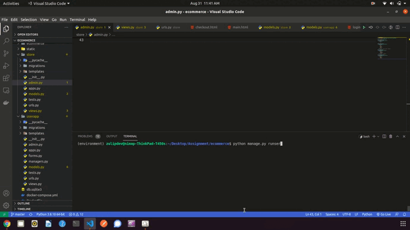

# Task To Manage Product In Inventory
<hr> 

### Technology Used In This Project
- Django
- Docker & docker-compose
- Bootstrap
- Js
- sqlite3 

<hr>
This is simple <strong>Django</strong> Based project which use to manage product in inventory.
<hr>

### To Run Project Follow Below Steps
- Create A Empty Folder By Name.
```shell
mkdir directory_name
```

- Change Directory To Recently Created One And Create Python Environment
```shell
python3 -m venv environment
```
- Clone The Project.
```shell
git clone project_link
```
- Change Directory To Cloned Project Directory And Install All Dependencies.
```shell
pip install -r requirements.txt
```

- After Installations Of All Dependencies And Creation Of .env File, Run Project By Typing.
```shell
python manage.py runserver
```

# Docker Based Installation

- If You Have Docker Install In Your System Simply Run The Below Command

<hr> 

- For Linux
```shell
 sudo docker-compose up
```

<hr>

- For Windows run this command as admin
```shell
 docker-compose up
```
